# Draw Daremon

画一个哆啦A梦.

### 画哆啦A梦的步骤

是根据《画哆啦A梦》的歌词内容绘制的

##### 圆圈中一点

##### 圆圈中一点

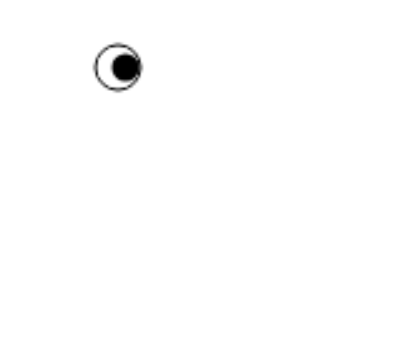

##### 豆子发芽了

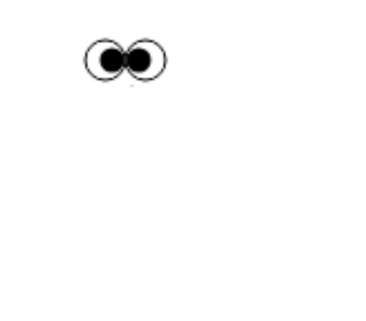

##### 圆圆的花盆

##### 圆圆的花盆

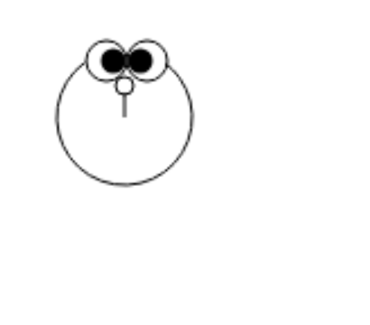

##### 六月六日的飞碟

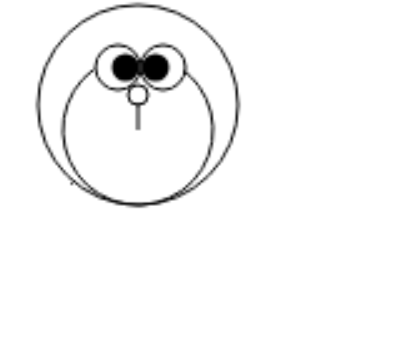

##### 左飞一次

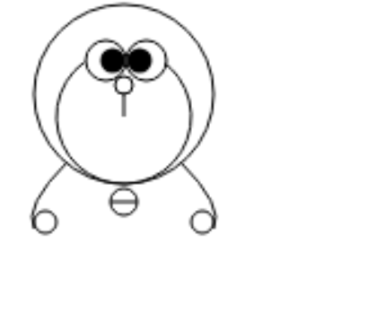

##### 右飞一次

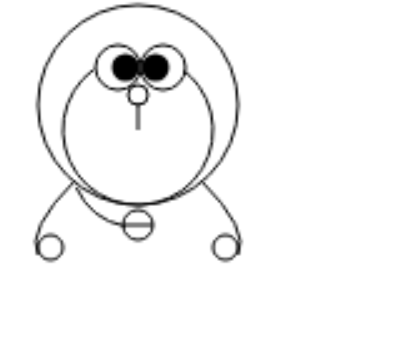

##### 落了下来

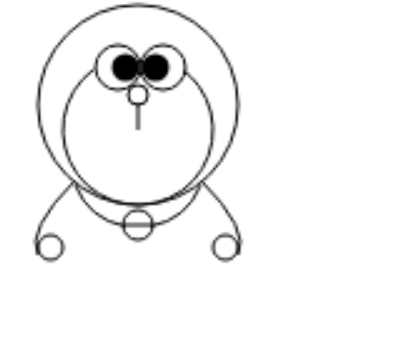

##### 两个池塘,建成了

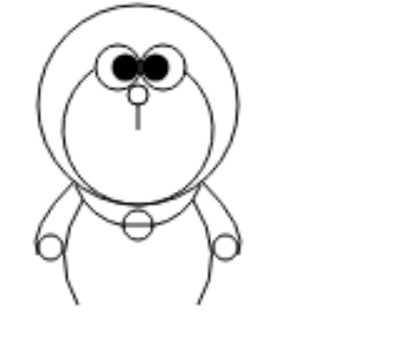

##### 池塘上浮着船

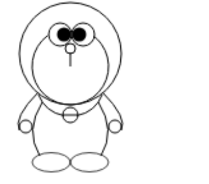

##### 空中的弯月,升起来了

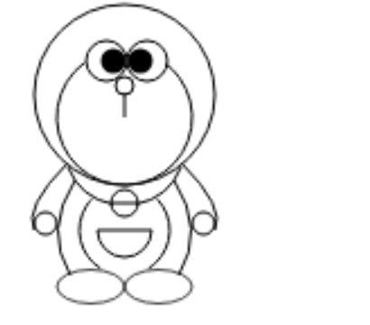

##### 再加上胡须,就是哆啦A梦

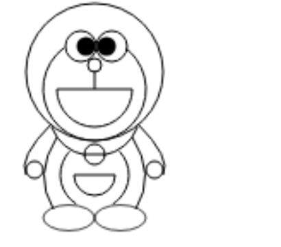

[demo](https://dongjialiang.github.io/draw-daremon/src/index.html)