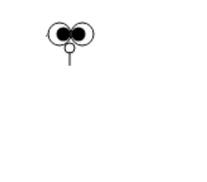

# Draw Daremon

画一个哆啦A梦.

### 画哆啦A梦的步骤

是根据《画哆啦A梦》的歌词内容绘制的

##### 圆圈中一点

##### 圆圈中一点

##### 豆子发芽了

##### 圆圆的花盆

##### 圆圆的花盆

##### 六月六日的飞碟

##### 左飞一次

##### 右飞一次

##### 落了下来

##### 两个池塘,建成了

##### 池塘上浮着船

##### 空中的弯月,升起来了

##### 再加上胡须,就是哆啦A梦

[demo](https://dongjialiang.github.io/draw-daremon/src/index.html)